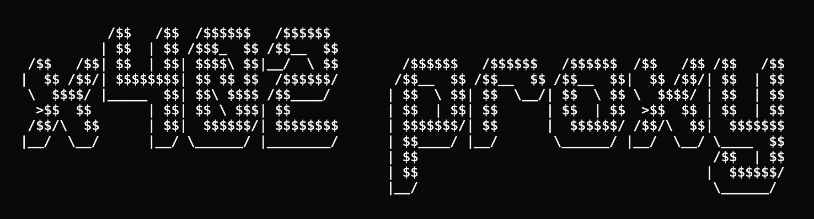

<div align="center">



# 💰 x402proxy

**Monetize Any API in Minutes** • Accept x402 Payments • Zero Code Changes Required

[](https://opensource.org/licenses/ISC)

</div>

---

## 🚀 What is x402proxy?

A **plug-and-play proxy** that accepts x402 payments. Set up in minutes and start selling one-time access to any API - whether it's a new service you're building or an existing API you want to monetize.

### ✨ Key Features

| Feature | Description |
|---------|-------------|
| 🌐 **Multi-chain support** | Works with Ethereum, Base, Solana, and more |
| 💰 **Direct payments** | Paywall any URL; payment straight to your wallet |
| 🏗️ **Flexible pricing** | Set one-time global or per-route pricing |
| 🔌 **Plug & play** | Works with any x402 facilitator |

### 📊 How It Works

```
[Client] → [x402proxy] → [Any API]
              ↓
         [facilitator]
```

**Simple architecture, powerful results.** Clients make requests, payments are verified via x402 facilitator, and your API gets protected automatically.

## 🚦 Getting Started

### 📋 Prerequisites

- **Docker** and **Docker Compose**

That's it! No complex dependencies or setup required.

---

### ⚡ Quick Start

**Get up and running in under 60 seconds** 🎯

#### Step 1: Download Starter Config

Download a starter configuration file (you can modify it as needed):

```bash
curl -o custom-config.json https://raw.githubusercontent.com/zachalam/x402proxy/refs/heads/main/custom-config.json
```

#### Step 2: Run with Docker

Mount your config to `/app/config.json` and run the container:

```bash
docker run -p 8080:8080 \
  -v $(pwd)/custom-config.json:/app/config.json:ro \
  ghcr.io/zachalam/x402proxy:latest
```

**That's it!** 🎉 Your API proxy is now running and accepting x402 payments.

---

## ⚙️ Configuration

### 📝 Config File Location

The application loads configuration **strictly from `/app/config.json`** inside the container. 

> ⚠️ **Important:** If this file is not mounted, the container will exit with an error.

### 🔧 Configuration Fields

| Field | Description |
|-------|-------------|
| `facilitatorUrl` | The X402 facilitator URL |
| `network` | Blockchain network (e.g., "base-sepolia") |
| `paymentAddress` | Receiving wallet address |
| `defaultPrice` | Default payment price for all routes |
| `protectedEndpoints` | Map of protected endpoints with prices and forwarding URLs |

### 📄 Sample Configuration

Here's a complete example configuration file (`custom-config.json`):

```json
{
  "facilitatorUrl": "https://x402.org/facilitator",
  "network": "base-sepolia",
  "paymentAddress": "0x5629562956295629562956295629562956295629",
  "defaultPrice": "$0.05",
  "protectedEndpoints": {
    "GET /cat": {
      "forwardTo": "https://api.thecatapi.com/v1/images/search"
    },
    "GET /dog": {
      "price": "$0.10",
      "forwardTo": "https://api.thedogapi.com/v1/images/search"
    },
    "GET /fact": {
      "price": "$0.15",
      "forwardTo": "https://catfact.ninja/fact"
    },
    "GET /joke": {
      "price": "$0.20",
      "forwardTo": "https://official-joke-api.appspot.com/random_joke"
    }
  }
}
```

> 💡 **Tip:** For large `protectedEndpoints` configurations, file mounting is recommended (no size limits).

---

## 🐳 GitHub Container Registry

### 🔄 Automatic Builds

The application is **automatically built and pushed** to GitHub Container Registry (ghcr.io) on every push to the main branch. 

Each push creates a new version tagged with an auto-incremented version number and also tagged as `latest`.

### 📦 Pull & Run Latest Image

```bash
# Pull the latest image
docker pull ghcr.io/zachalam/x402proxy:latest

# Run with default port (config must be mounted to /app/config.json)
docker run -p 8080:8080 \
  -v $(pwd)/custom-config.json:/app/config.json:ro \
  ghcr.io/zachalam/x402proxy:latest

# Run with custom external port
docker run -p 4020:8080 -e PORT=8080 \
  -v $(pwd)/custom-config.json:/app/config.json:ro \
  ghcr.io/zachalam/x402proxy:latest
```


---

## 💻 Local Development

### 🚫 Without Docker

Perfect for quick local testing and development:

```bash
# Install dependencies
npm install

# Run in development mode with nodemon (hot reload)
npm run dev

# Run in production mode
npm start
```

> 📍 The application will be available at `http://localhost:3000`

---

### 🐳 With Docker (Recommended)

Use Docker for a consistent development environment with hot reload:

```bash
# Build and run the development container with hot reload
docker-compose up

# Run in detached mode (background)
docker-compose up -d

# View logs
docker-compose logs -f

# Stop the container
docker-compose down
```

> 📍 The application will be available at `http://localhost:3000`

> ⚠️ **Note:** You must mount your config to `/app/config.json`. If the file is missing, the container will exit with an error.

---

## 🏗️ Architecture

| Environment | Details |
|-------------|---------|
| **Development** (`docker-compose.yml`) | Uses nodemon for hot reload, mounts source code as volume |
| **Production** (`Dockerfile`) | Optimized image with only production dependencies, runs as non-root user |

---

## 📄 License

This project is licensed under the **ISC License**.

---

<div align="center">

### ⭐ Star this repo if you find it useful!

**Built with ❤️ for the x402 ecosystem**

[Report Bug](https://github.com/zachalam/x402proxy/issues) • [Request Feature](https://github.com/zachalam/x402proxy/issues) • [Contribute](https://github.com/zachalam/x402proxy/pulls)

</div>
